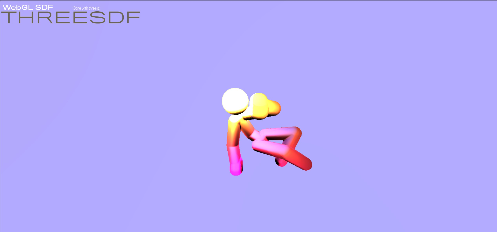

# Threesdf

Three.js experiment with advanced technic to render Signed Distance Field like in [shadertoy](https://shadertoy.com)

## Description

This project aim to render a Signed Distance Field using a glb model animation. Bones animation is parsed and passed to custom shader to animate the SDF.

## Youtube video

Check the [video](https://youtu.be/YFtmx5Ad26Y) on youtube.

